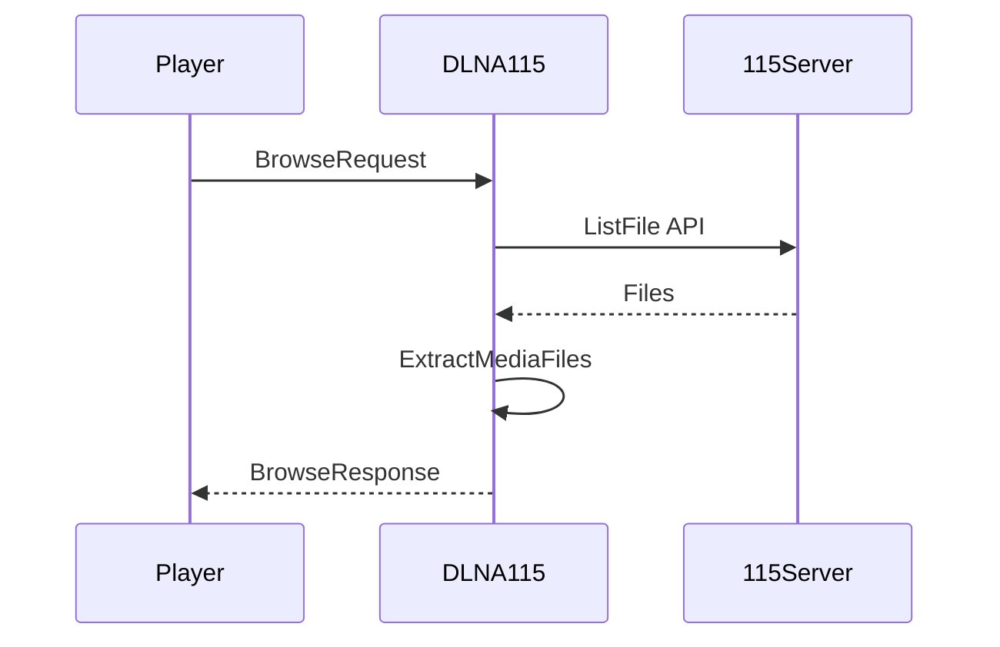
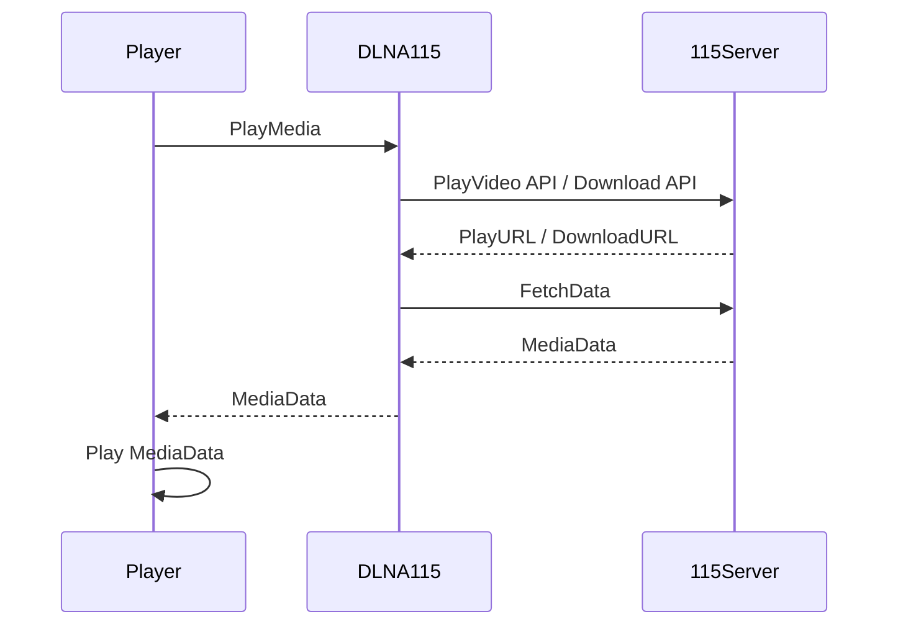

# 实现原理

DLNA115 将来自播放器的 DLNA 请求，转换为对 115 API 的调用，并将 API 的响应转换为 DLNA 响应，返回给播放器。

在播放视频时，DLNA115 负责获取从 115 下载媒体数据，并转发给播放器端。

整个过程中不会把任何文件下载到本地，因此对存储空间没有太大要求，可将 DLNA115 服务运行在配置较低的嵌入式设备上，如树莓派，NAS 等。

## 浏览文件

## 播放文件

